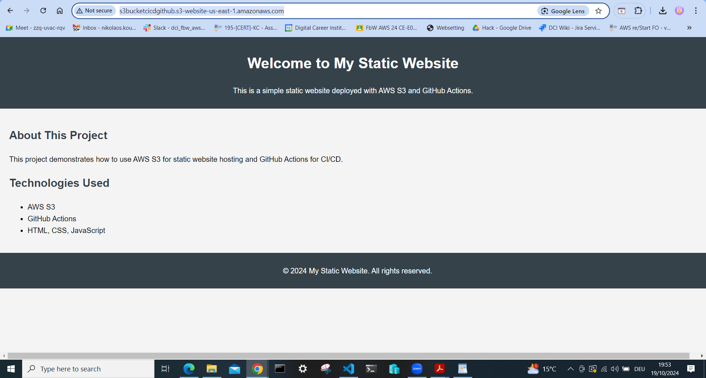

# My Static Website

Welcome to my static website! This project demonstrates how to deploy a static website using AWS S3 and automate the deployment with GitHub Actions.

## Technologies Used
- **AWS S3**: For hosting the static website.
- **GitHub Actions**: For continuous integration and deployment.
- **HTML**: For the structure of the website.
- **CSS**: For styling.

## Features
- Simple and responsive layout.
- Hosted on AWS S3.
- Automated deployment via GitHub Actions.

## How to Run
You can view the live site at http://s3bucketcicdgithub.s3-website-us-east-1.amazonaws.com/.

## Demonstration
  
*Screenshot of the website in a web browser.*

## License
This project is licensed under the MIT License - see the [LICENSE](LICENSE) file for details.
